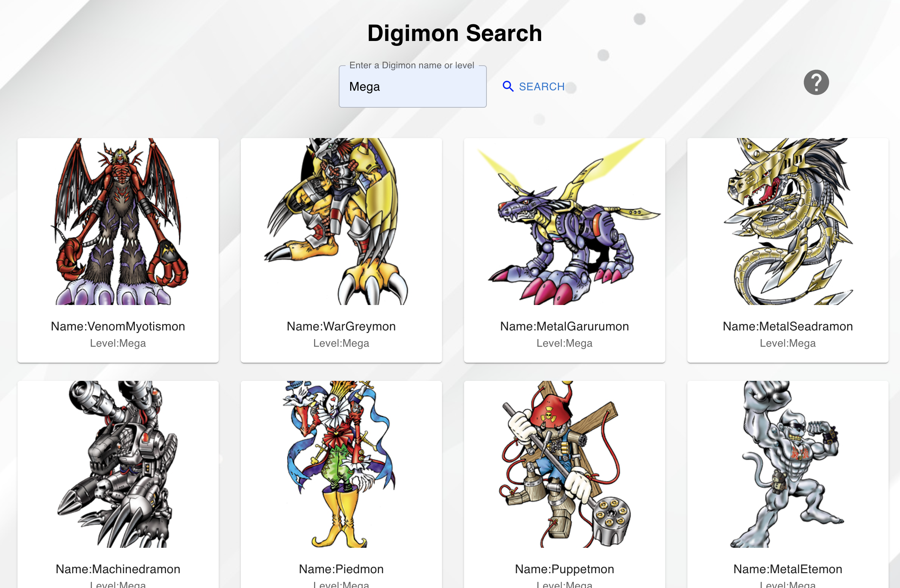

# Digimon Search

This is a Typescript project with a REST API that allows you to search for digimon.
You can search for a digimon by name,or level. You can see some names and levels example 
by clicking the help button in the project, You can use them to test the project and see the effect.



You also can see the website demo in [here](https://qingyang0506.github.io/Digimon-Search/);
or you can download the project ,direct to the folder and run by below commands
```
1. npm install
2. npm start
```